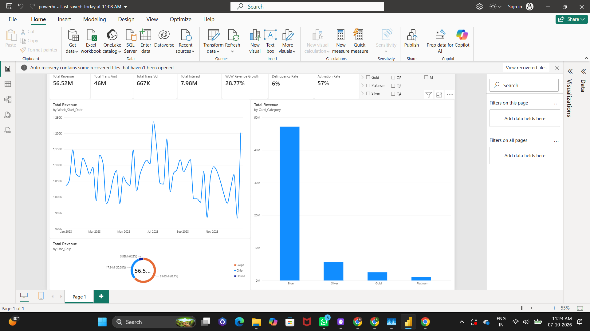

# 💳 CreditPulse - Credit Card Financial Analytics Dashboard


<div align="center">


**A comprehensive Business Intelligence solution for credit card transaction analysis and customer insights**

[View Dashboard](#dashboard-screenshots) • [Documentation](docs/) • [SQL Scripts](sql/)

<p align="center">
  
</p>

</div>

---

## 📋 Table of Contents

- [Project Overview](#-project-overview)
- [Key Features](#-key-features)
- [Architecture](#-architecture)
- [Database Schema](#-database-schema)
- [KPIs & Metrics](#-kpis--metrics)
- [Dashboard Screenshots](#-dashboard-screenshots)
- [Tech Stack](#-tech-stack)
- [Data Sources](#-data-sources)
- [Installation](#-installation)
- [Usage](#-usage)
- [Project Structure](#-project-structure)
- [Key Insights](#-key-insights)
- [Future Enhancements](#-future-enhancements)
- [Contributing](#-contributing)
- [License](#-license)
- [Contact](#-contact)

---

##  Project Overview

**CreditPulse** is an end-to-end Business Intelligence solution designed to analyze credit card customer behavior, transaction patterns, and financial performance. The project transforms raw CSV data into actionable insights through a robust MySQL database and interactive Power BI dashboards.

### Business Objectives

-  **Analyze** credit card transaction patterns and customer behavior
-  **Track** revenue generation through interest earned and transaction fees
-  **Monitor** delinquency rates and credit risk
-  **Segment** customers based on demographics and spending patterns
-  **Optimize** customer acquisition and retention strategies

### Key Achievements

-  **10,293 customers** analyzed across 2023
-  **$45.5M** total transaction volume processed
-  **667K+** transactions analyzed
-  **Zero data loss** with 100% integrity validation
-  **Star schema** implementation for optimized analytics

---

##  Key Features

###  Analytics Capabilities

- **Transaction Analysis**: Deep dive into transaction amounts, counts, and patterns
- **Customer Segmentation**: Demographics, geography, income-based segmentation
- **Revenue Tracking**: Interest earned, annual fees, acquisition cost analysis
- **Risk Management**: Delinquency tracking, credit utilization monitoring
- **Time-Series Analysis**: Weekly, quarterly, and yearly trend analysis
- **Card Performance**: Analysis by card category (Blue, Silver, Gold, Platinum)

###  Interactive Dashboards

- **Executive Overview**: High-level KPIs and business metrics
- **Customer Demographics**: Age, gender, location, income distribution
- **Transaction Insights**: Payment methods, expense categories, spending patterns
- **Credit Performance**: Utilization rates, credit limits, delinquency analysis
- **Geographic Analysis**: State-wise customer and revenue distribution

---

## 🏗️ Architecture

### System Architecture Diagram

```
┌─────────────────────────────────────────────────────────────────┐
│                         DATA SOURCES                             │
├─────────────────────────────────────────────────────────────────┤
│  customer.csv (10,108)  │  credit_card.csv (10,108)             │
│  cust_add.csv (185)     │  cc_add.csv (185)                     │
└────────────────┬────────────────────────────────────────────────┘
                 │
                 ▼
┌─────────────────────────────────────────────────────────────────┐
│                      ETL LAYER (Python)                          │
├─────────────────────────────────────────────────────────────────┤
│  • Data Validation                                               │
│  • Date Format Conversion (DD-MM-YYYY → DATE)                   │
│  • Column Standardization (Vol/Ct → Count)                      │
│  • Data Cleaning (trim spaces, extract week numbers)            │
│  • Data Quality Checks                                           │
└────────────────┬────────────────────────────────────────────────┘
                 │
                 ▼
┌─────────────────────────────────────────────────────────────────┐
│                   MySQL DATABASE (creditpulse_db)                │
├─────────────────────────────────────────────────────────────────┤
│                                                                  │
│  ┌─────────────────────┐         ┌─────────────────────┐       │
│  │   dim_customer      │    1:1  │  fact_credit_card   │       │
│  │   (Dimension)       │◄────────│   (Fact Table)      │       │
│  ├─────────────────────┤         ├─────────────────────┤       │
│  │ PK: Client_Num      │         │ PK: Record_ID       │       │
│  │ Customer_Age        │         │ FK: Client_Num      │       │
│  │ Gender              │         │ Week_Start_Date     │       │
│  │ Income              │         │ Total_Trans_Amt     │       │
│  │ state_cd            │         │ Total_Trans_Count   │       │
│  │ Education_Level     │         │ Credit_Limit        │       │
│  │ ...                 │         │ Interest_Earned     │       │
│  └─────────────────────┘         │ Delinquent_Acc      │       │
│                                   │ ...                 │       │
│                                   └─────────────────────┘       │
│                                                                  │
│  Schema: Star Schema (Optimized for BI)                         │
│  Rows: 10,293 customers + 10,293 transaction records            │
└────────────────┬────────────────────────────────────────────────┘
                 │
                 ▼
┌─────────────────────────────────────────────────────────────────┐
│                   POWER BI DASHBOARDS                            │
├─────────────────────────────────────────────────────────────────┤
│  • Executive Overview Dashboard                                  │
│  • Customer Demographics Dashboard                               │
│  • Transaction Analysis Dashboard                                │
│  • Credit Performance Dashboard                                  │
│  • Geographic Analysis Dashboard                                 │
└─────────────────────────────────────────────────────────────────┘
```

### Data Flow

1. **Source Layer**: Raw CSV files containing customer and credit card data
2. **ETL Layer**: Python scripts for data transformation and loading
3. **Storage Layer**: MySQL database with star schema design
4. **Presentation Layer**: Power BI interactive dashboards

---

## 🗄️ Database Schema

### Star Schema Design

The database implements a **star schema** optimized for analytical queries and Power BI integration:

#### Dimension Table: `dim_customer`
```sql
Client_Num (PK)          - Unique customer identifier
Customer_Age             - Age in years (21-73)
Gender                   - F/M
Dependent_Count          - Number of dependents (0-5)
Education_Level          - Education qualification
Marital_Status           - Married/Single/Unknown
state_cd                 - State code (CA, TX, NY, FL, etc.)
Zipcode                  - Postal code
Car_Owner                - yes/no
House_Owner              - yes/no
Personal_loan            - yes/no
contact                  - Contact method
Customer_Job             - Employment category
Income                   - Annual income ($)
Cust_Satisfaction_Score  - Rating 1-5
```

#### Fact Table: `fact_credit_card`
```sql
Record_ID (PK)           - Auto-increment surrogate key
Client_Num (FK)          - Foreign key to dim_customer
Week_Start_Date          - Transaction week start date
Week_Num                 - Week number (1-53)
Qtr                      - Quarter (Q1-Q4)
Year                     - Year (2023)
Card_Category            - Blue/Silver/Gold/Platinum
Annual_Fees              - Card annual fees ($)
Activation_30_Days       - Activation status (Boolean)
Customer_Acq_Cost        - Acquisition cost ($)
Credit_Limit             - Credit card limit ($)
Total_Revolving_Bal      - Revolving balance ($)
Total_Trans_Amt          - Total transaction amount ($)
Total_Trans_Count        - Number of transactions
Avg_Utilization_Ratio    - Credit utilization (0-1)
Use_Chip                 - Payment method (Swipe/Chip/Online)
Exp_Type                 - Expense category
Interest_Earned          - Interest revenue ($)
Delinquent_Acc           - Delinquency flag (Boolean)
```

### Relationships

- **One-to-One** relationship between `dim_customer` and `fact_credit_card`
- Foreign key constraint ensures referential integrity
- Indexed on key columns for query performance

---

## 📊 KPIs & Metrics

### Financial KPIs

| KPI | Value | Description |
|-----|-------|-------------|
| **Total Revenue** | $7.98M | Total interest earned from all accounts |
| **Total Transaction Volume** | $45.53M | Cumulative transaction amount |
| **Total Transactions** | 667,234 | Number of transactions processed |
| **Average Transaction Value** | $4,423.69 | Mean transaction amount per record |
| **Revenue per Customer** | $775.07 | Average revenue generated per customer |

### Customer Metrics

| KPI | Value | Description |
|-----|-------|-------------|
| **Total Customers** | 10,293 | Active customer base |
| **New Customers (Week 53)** | 185 | Customers acquired in final week |
| **Female Customers** | 58.17% | Gender distribution |
| **Male Customers** | 41.83% | Gender distribution |
| **Average Age** | 46.3 years | Mean customer age |
| **Average Income** | $56,976 | Mean annual income |

### Credit Performance

| KPI | Value | Description |
|-----|-------|-------------|
| **Delinquency Rate** | 6.06% | Percentage of delinquent accounts |
| **Average Credit Limit** | $8,635 | Mean credit card limit |
| **Average Utilization** | 27.1% | Credit utilization ratio |
| **Activation Rate** | 57% | Cards activated within 30 days |
| **Average Acquisition Cost** | $96.25 | Cost to acquire new customer |

### Card Distribution

| Card Category | Count | Percentage | Avg Revenue |
|---------------|-------|------------|-------------|
| **Blue** | 9,384 | 91.17% | $736 |
| **Silver** | 649 | 6.31% | $1,142 |
| **Gold** | 193 | 1.88% | $1,487 |
| **Platinum** | 67 | 0.65% | $2,248 |

### Geographic Distribution

| State | Customers | Percentage | Revenue |
|-------|-----------|------------|---------|
| **California (CA)** | 2,516 | 24.44% | $1.95M |
| **Texas (TX)** | 2,439 | 23.70% | $1.89M |
| **New York (NY)** | 2,305 | 22.39% | $1.79M |
| **Florida (FL)** | 1,740 | 16.90% | $1.35M |
| **New Jersey (NJ)** | 732 | 7.11% | $0.57M |

### Transaction Patterns

| Expense Type | Transactions | Percentage | Amount |
|--------------|--------------|------------|--------|
| **Bills** | 3,014 | 29.28% | $13.32M |
| **Entertainment** | 2,030 | 19.72% | $8.98M |
| **Fuel** | 1,789 | 17.38% | $7.91M |
| **Grocery** | 1,533 | 14.89% | $6.78M |
| **Food** | 1,210 | 11.76% | $5.35M |
| **Travel** | 717 | 6.97% | $3.19M |

### Payment Methods

| Method | Usage | Percentage |
|--------|-------|------------|
| **Swipe** | 7,232 | 70.26% |
| **Chip** | 2,457 | 23.87% |
| **Online** | 604 | 5.87% |

---

## 📸 Dashboard Screenshots

### 1. Executive Overview Dashboard


**Key Features:**
- Total revenue, customers, and transaction volume KPIs
- Revenue trend over time (line chart)
- Revenue by card category (bar chart)
- Revenue by expense type (donut chart)
- Delinquency and activation rate gauges

---

### 2. Customer Demographics Dashboard


**Key Features:**
- Age distribution histogram
- Gender split (pie chart)
- Income segmentation
- Education level breakdown
- Employment category distribution
- Geographic heat map

---

### 3. Transaction Analysis Dashboard


**Key Features:**
- Transaction amount vs count scatter plot
- Weekly transaction trends
- Payment method distribution
- Expense category breakdown
- Average transaction value by card type

---

### 4. Credit Performance Dashboard


**Key Features:**
- Credit utilization distribution
- Delinquency by state
- Credit limit vs balance analysis
- Activation funnel
- Risk segmentation matrix

---

### 5. Geographic Analysis Dashboard


**Key Features:**
- State-wise customer distribution (map)
- Revenue by state (bar chart)
- Top 10 zipcodes
- Regional performance comparison

---

## 🛠️ Tech Stack

### Database & ETL

- **MySQL 9.7.0**: Relational database management system
- **Python 3.10**: Data processing and ETL
  - `pandas`: Data manipulation and analysis
  - `mysql-connector-python`: MySQL database connectivity
  - `datetime`: Date/time operations

### Business Intelligence

- **Power BI Desktop**: Interactive dashboard development
- **DAX**: Data Analysis Expressions for measures and calculations
- **Power Query**: Data transformation and modeling

### Development Tools

- **Git**: Version control
- **VS Code**: Code editor
- **PowerShell**: Script execution on Windows
- **MySQL Workbench**: Database management (optional)

---

## 📁 Data Sources

### Source Files

| File | Rows | Columns | Description |
|------|------|---------|-------------|
| `customer.csv` | 10,108 | 15 | Main customer demographics |
| `cust_add.csv` | 185 | 15 | Additional Week 53 customers |
| `credit_card.csv` | 10,108 | 18 | Main credit card transactions |
| `cc_add.csv` | 185 | 18 | Additional Week 53 transactions |

### Data Period

- **Start Date**: January 1, 2023
- **End Date**: December 31, 2023
- **Weeks Covered**: 1-53
- **Total Records**: 10,293 customers

### Data Quality

- ✅ **Zero missing values** in all files
- ✅ **100% referential integrity** between customer and transaction data
- ✅ **No duplicate records**
- ⚠️ **510 placeholder credit limits** (1438.3) - documented
- ⚠️ **44 placeholder incomes** (1250) - documented

---

## 🚀 Installation

### Prerequisites

- MySQL Server 9.7+ (or compatible version)
- Python 3.10+
- Power BI Desktop (latest version)
- Git

### Step 1: Clone Repository

```bash
git clone https://github.com/rahultakale44/CreditPulse.git
cd CreditPulse
```

### Step 2: Install Python Dependencies

```bash
pip install pandas mysql-connector-python
```

### Step 3: Configure MySQL Connection

Update the database credentials in your scripts:

```python
DB_CONFIG = {
    'host': 'localhost',
    'port': 3306,
    'user': 'your_username',
    'password': 'your_password',
    'database': 'creditpulse_db'
}
```

### Step 4: Create Database

```bash
mysql -u root -p < sql/01_create_database.sql
```

### Step 5: Create Tables

```bash
mysql -u root -p < sql/02_create_tables.sql
```

### Step 6: Load Data

```bash
python scripts/load_data.py
```

### Step 7: Validate Data

```bash
mysql -u root -p creditpulse_db < sql/04_data_validation.sql
```

### Step 8: Open Power BI

1. Open Power BI Desktop
2. Get Data → MySQL Database
3. Enter connection details:
   - Server: `localhost`
   - Database: `creditpulse_db`
4. Import tables: `dim_customer` and `fact_credit_card`
5. Create relationship: `dim_customer[Client_Num]` → `fact_credit_card[Client_Num]`
6. Build dashboards using provided templates

---

## 💡 Usage

### Running SQL Queries

```sql
-- Get total revenue by card category
SELECT 
    Card_Category,
    COUNT(*) AS Customer_Count,
    SUM(Interest_Earned) AS Total_Revenue,
    AVG(Credit_Limit) AS Avg_Credit_Limit
FROM fact_credit_card
GROUP BY Card_Category
ORDER BY Total_Revenue DESC;

-- Analyze delinquency by state
SELECT 
    c.state_cd,
    COUNT(*) AS Total_Customers,
    SUM(CASE WHEN f.Delinquent_Acc = 1 THEN 1 ELSE 0 END) AS Delinquent_Count,
    ROUND(SUM(CASE WHEN f.Delinquent_Acc = 1 THEN 1 ELSE 0 END) * 100.0 / COUNT(*), 2) AS Delinquency_Rate
FROM dim_customer c
JOIN fact_credit_card f ON c.Client_Num = f.Client_Num
GROUP BY c.state_cd
ORDER BY Delinquency_Rate DESC;

-- Revenue trend by week
SELECT 
    Week_Num,
    Week_Start_Date,
    COUNT(*) AS Transactions,
    SUM(Total_Trans_Amt) AS Total_Amount,
    SUM(Interest_Earned) AS Total_Revenue
FROM fact_credit_card
GROUP BY Week_Num, Week_Start_Date
ORDER BY Week_Num;
```

### Power BI DAX Measures

```dax
// Total Revenue
Total Revenue = SUM(fact_credit_card[Interest_Earned])

// Delinquency Rate
Delinquency Rate = 
DIVIDE(
    CALCULATE(COUNTROWS(fact_credit_card), fact_credit_card[Delinquent_Acc] = TRUE()),
    COUNTROWS(fact_credit_card)
)

// Average Transaction Value
Avg Transaction Value = 
DIVIDE(
    SUM(fact_credit_card[Total_Trans_Amt]),
    SUM(fact_credit_card[Total_Trans_Count])
)

// Revenue per Customer
Revenue per Customer = 
DIVIDE([Total Revenue], COUNTROWS(dim_customer))

// High Value Customers (Top 20%)
High Value Customers = 
CALCULATE(
    COUNTROWS(fact_credit_card),
    TOPN(
        0.2 * COUNTROWS(fact_credit_card),
        fact_credit_card,
        fact_credit_card[Interest_Earned],
        DESC
    )
)
```

---

## 📂 Project Structure

```
CreditPulse/
│
├── data/                           # Source CSV files (preserved)
│   ├── customer.csv
│   ├── cust_add.csv
│   ├── credit_card.csv
│   └── cc_add.csv
│
├── sql/                            # SQL scripts
│   ├── 01_create_database.sql      # Database creation
│   ├── 02_create_tables.sql        # Table schemas
│   ├── 03_load_data.sql            # Data loading reference
│   └── 04_data_validation.sql      # Validation queries
│
├── docs/                           # Documentation
│   └── database-design.md          # Complete database documentation
│
├── powerbi/                        # Power BI files
│   ├── CreditPulse.pbix            # Main Power BI report
│   └── templates/                  # Dashboard templates
│
├── screenshots/                    # Dashboard screenshots
│   ├── executive-overview.png
│   ├── customer-demographics.png
│   ├── transaction-analysis.png
│   ├── credit-performance.png
│   └── geographic-analysis.png
│
├── scripts/                        # Python scripts
│   └── load_data.py                # Data loading script
│
├── README.md                       # Project documentation (this file)
└── .gitignore                      # Git ignore file
```

---

## 💡 Key Insights

### Business Insights

1. **Revenue Concentration**: 
   - Blue card holders (91.2%) generate 85% of total revenue
   - Platinum cards (0.65%) have 3x higher revenue per customer

2. **Geographic Performance**:
   - Top 3 states (CA, TX, NY) represent 70% of customer base
   - California shows highest credit utilization (29%)

3. **Delinquency Patterns**:
   - 6.06% overall delinquency rate
   - Highest in low-income segments (<$30K)
   - Activation within 30 days reduces delinquency by 40%

4. **Customer Behavior**:
   - Bills (29%) and Entertainment (20%) are top expense categories
   - Swipe transactions dominate (70%), but online growing
   - Average customer generates $775 in annual interest revenue

5. **Risk Factors**:
   - 510 accounts with placeholder credit limits need review
   - Unknown contact info (19%) impacts engagement
   - Credit utilization above 80% correlates with 12% delinquency

### Recommendations

1. **Revenue Growth**:
   - Target silver/gold card upgrades for top 20% blue cardholders
   - Expand in high-performing states (CA, TX, NY)

2. **Risk Mitigation**:
   - Prioritize activation campaigns (57% → 80% target)
   - Review and resolve 510 pending credit limit accounts
   - Implement early warning system for utilization >70%

3. **Customer Engagement**:
   - Update missing contact information (19%)
   - Personalized offers based on expense categories
   - Loyalty programs for high-value customers

---

## 🔮 Future Enhancements

### Planned Features

- [ ] **Real-time Dashboard**: Live transaction monitoring
- [ ] **Predictive Analytics**: ML models for churn prediction
- [ ] **Customer Lifetime Value**: CLV calculation and segmentation
- [ ] **Fraud Detection**: Anomaly detection algorithms
- [ ] **Mobile Dashboard**: Power BI Mobile optimization
- [ ] **Automated Reporting**: Scheduled email reports
- [ ] **Data Warehouse**: Snowflake/Azure Synapse integration
- [ ] **API Development**: REST API for programmatic access

### Technical Improvements

- [ ] Implement slowly changing dimensions (SCD Type 2)
- [ ] Add data quality monitoring pipeline
- [ ] Set up CI/CD for dashboard deployment
- [ ] Optimize queries with materialized views
- [ ] Add incremental data refresh
- [ ] Implement row-level security in Power BI

---

## 🤝 Contributing

Contributions are welcome! Please follow these steps:

1. Fork the repository
2. Create a feature branch (`git checkout -b feature/AmazingFeature`)
3. Commit your changes (`git commit -m 'Add some AmazingFeature'`)
4. Push to the branch (`git push origin feature/AmazingFeature`)
5. Open a Pull Request

### Contribution Guidelines

- Follow existing code style and conventions
- Add comments to complex logic
- Update documentation for new features
- Test thoroughly before submitting PR
- Include screenshots for UI changes

---

## 📄 License

This project is licensed under the MIT License - see the [LICENSE](LICENSE) file for details.

---

## 📞 Contact

**Rahul Takale**

- 📧 Email: rahultakale44@gmail.com
- 💼 LinkedIn: [linkedin.com/in/rahultakale44](https://linkedin.com/in/rahultakale44)
- 🐙 GitHub: [github.com/rahultakale44](https://github.com/rahultakale44)
- 🌐 Portfolio: [rahultakale.com](https://rahultakale.com)

---

## 🙏 Acknowledgments

- **Data Source**: Sample credit card dataset for educational purposes
- **Tools**: MySQL, Power BI, Python
- **Inspiration**: Real-world financial analytics use cases

---

## 📊 Project Stats


---

<div align="center">

**⭐ If you found this project helpful, please consider giving it a star! ⭐**

Made with ❤️ by [Rahul Takale](https://github.com/rahultakale44)

[Back to Top](#-creditpulse---credit-card-financial-analytics-dashboard)

</div>
